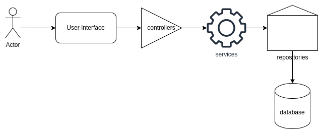

# Kanban Board Desktop Application

## Summary of this document
- **Technologies**: the language and libaries used for this project
- **Application Setup**: Steps to setup the application
- **Features**: Description of product features
- **Architecture**: Design patterns followed
- **Contribution Guidelines**: How can I contribute to the project?

## Technologies
- **Programming Language**: Python
- **Libaries and their versions**: requirements.txt
- **Database**: Mongodb (Atlas or locally hosted)

## Application Setup
### Platform compatability:
- OS: Linux, Windows 10, Mac
- IDE: Visual studio 2022, vscode (anything that can run a python command line appliaction)

### Steps to run the application in Visual Studio 2022

- Clone the repository
- Import the .sln file (present at the root of the project)
- Create a virtual environment from the requirements.txt file
    - You can also create a virtual environment and the install the dependencies using requirements.txt file
- Add databse credentials in constants/db.py file else your app would run in pilot mode
- Setup awt_coursework.py as the startup file and run the project

## Features

- The user can signup with a unique username
- The user can add, create, update and delete tasks
- The user can place the tasks in one of the following categories:
    - Backlog
    - Todo
    - In Progress
    - Done
- The user can view the number of tasks in each category
- If the user has made undesirable changes, they can just cancel those changes

## Architecture

### Directory Structure
- awt_coureswork
    - constants
        - db.py
    - controllers
        - tasks.py
    - database
        - mongo_db_connection.py
        - schemas.py
        - validate.py
    - repositories
        - tasks.py
        - users.py
    - services
        - auth.py
        - tasks.py
    - awt_coureswork.py
    - README.md
    - requirements.txt

As you may observe that we have strictly ensured a separation of concerns in the directory structure. The data layer, business logic layer, and presentation layer have been carefuly seperated in repositories, services, and the main file (awt_coursework.py) respectively. The controllers sit in between the user interface and the business logic to direct the requests to the right service. This approach is also known as the repository pattern.

Apart from that, the repositories and database connection have singleton classes. This reduces the number of dangling objects created in the memory.

### Architecture Diagram

## Future work
- Ability to create subtasks
- Separate the UI layer into a frontend web app and convert controllers into an API using flask

## Contribution Guidelines
- Clone the repository
- Create a feature branch or a bugfix branch
- Push your changes and create a pull request
